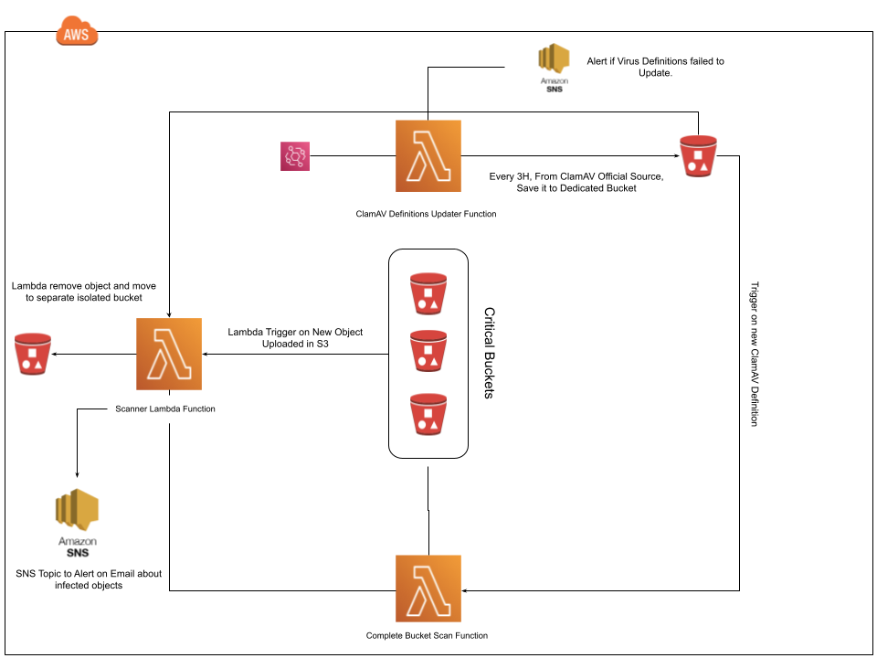

# AWS S3 Buckets Virus Scanner

Scan new objects added to any s3 bucket using AWS Lambda. The Repo is Mod of [bucket-antivirus-function](https://github.com/UKForeignOffice/bucket-antivirus-function), Kudos  👏 to contributers.



## Overview

Using [S3 Event Notifications](http://docs.aws.amazon.com/AmazonS3/latest/user-guide/enable-event-notifications.html), a[ Lambda function is invoked](http://docs.aws.amazon.com/lambda/latest/dg/with-s3.html) to scan the newly uploaded file. The function will download the object from S3 and scan it for viruses using the open-source antivirus software [ClamAV](https://www.clamav.net/). Once scanning is complete, the function will add 3 tags to the S3 object, av-status and av-timestamp. av-status can have a value of either CLEAN or INFECTED. S3 bucket policies prevent anybody from reading a file where the status is INFECTED.

## Features

- EveryThing is in Terraform.
- 3 Functions
- Update ClamAv Definations
  - Objects Scanner Function
  - Whole Bucket Scanner (When Defination Updated)
- SNS Topic and Email Subscription.

  - Alarm on Innfected Object Found.
  - Alarm if Virus Definations Failed to get updated.
- Prevent reading of infected files using S3 bucket policies.

## Requirements

- AWS Environment Buckets to Scan.
- Terraform > 0.13

## How it Works ?

- Each time a new object is added to a bucket, S3 invokes the Lambda function to scan the object.
- The function package will download (if needed) current antivirus definitions from a S3 bucket. Transfer speeds between a S3 bucket and Lambda are typically faster and more reliable than another source.
- The object is scanned for viruses and malware. Archive files are extracted and the files inside scanned also.
- The objects tags are updated to reflect the result of the scan, CLEAN or INFECTED, along with the date and time of the scan.
- Scan results are published to a SNS topic ( Only publish INFECTED results) and then alert to subscribed email.
- Files found to be INFECTED are automatically moved to the isolated Bucket and deleted from the source bucket.
- Update Antivirus Definition Every 3 hours.
- Whenever CLAMAV Definition is updated, Rerun on all objects in Bucket.
- SNS Topic Alerts if CLAMAV Failed to update.

## Terraform Configurations

Enable s3 State Bucket File.
- `terraform init -backend=true -backend-config="bucket=virus-scanner-tfstate" -backend-config="key=terraform.tfstate" -backend-config="region=ap-southeast-1"`


| Variable                 | Description                                                  | Default | Required |
| ------------------------ | ------------------------------------------------------------ | ------- | -------- |
| buckets-to-scan          | Buckets To Scan                                              |         | Yes      |
| AV_DELETE_INFECTED_FILES | Delete Infected Files                                        | False   | Yes      |
| AV_MOVE_INFECTED_FILES   | Move files to another bucket                                 | True    | Yes      |
| sns-notifications-emails | variable.tf, Email to get notified                           | N/A     | True     |
| antivirus-update-rate    | When to check new definations, terraform-aws-bucket-antivirus/variables.tf | 3 H     | Yes      |


## Lamda Configuration

Runtime configuration is accomplished using environment variables. See the table below for reference.

| Variable                         | Description                                                  | Default          | Required |
| -------------------------------- | ------------------------------------------------------------ | ---------------- | -------- |
| AV_DEFINITION_S3_BUCKET          | Bucket containing antivirus definition files                 |                  | Yes      |
| AV_DEFINITION_S3_PREFIX          | Prefix for antivirus definition files                        | clamav_defs      | No       |
| AV_DEFINITION_PATH               | Path containing files at runtime                             | /tmp/clamav_defs | No       |
| AV_SCAN_START_SNS_ARN            | SNS topic ARN to publish notification about start of scan    |                  | No       |
| AV_SCAN_START_METADATA           | The tag/metadata indicating the start of the scan            | av-scan-start    | No       |
| AV_SIGNATURE_METADATA            | The tag/metadata name representing file's AV type            | av-signature     | No       |
| AV_STATUS_CLEAN                  | The value assigned to clean items inside of tags/metadata    | CLEAN            | No       |
| AV_STATUS_INFECTED               | The value assigned to clean items inside of tags/metadata    | INFECTED         | No       |
| AV_STATUS_METADATA               | The tag/metadata name representing file's AV status          | av-status        | No       |
| AV_STATUS_SNS_ARN                | SNS topic ARN to publish scan results (optional)             |                  | No       |
| AV_STATUS_SNS_PUBLISH_CLEAN      | Publish AV_STATUS_CLEAN results to AV_STATUS_SNS_ARN         | True             | No       |
| AV_STATUS_SNS_PUBLISH_INFECTED   | Publish AV_STATUS_INFECTED results to AV_STATUS_SNS_ARN      | True             | No       |
| AV_TIMESTAMP_METADATA            | The tag/metadata name representing file's scan time          | av-timestamp     | No       |
| CLAMAVLIB_PATH                   | Path to ClamAV library files                                 | ./bin            | No       |
| CLAMSCAN_PATH                    | Path to ClamAV clamscan binary                               | ./bin/clamscan   | No       |
| FRESHCLAM_PATH                   | Path to ClamAV freshclam binary                              | ./bin/freshclam  | No       |
| DATADOG_API_KEY                  | API Key for pushing metrics to DataDog (optional)            |                  | No       |
| AV_PROCESS_ORIGINAL_VERSION_ONLY | Controls that only original version of an S3 key is processed (if bucket versioning is enabled) | False            | No       |
| AV_DELETE_INFECTED_FILES         | Controls whether infected files should be automatically deleted | False            | No       |
| EVENT_SOURCE                     | The source of antivirus scan event "S3" or "SNS" (optional)  | S3               | No       |


## To-do

- make archive not working with bash script.

  ```make: *** No rule to make target `archive'.  Stop.```

- Dynamic SNS Topic arn in lamda variable.

## License

```
Licensed under the Apache License, Version 2.0 (the "License");
you may not use this file except in compliance with the License.
You may obtain a copy of the License at

http://www.apache.org/licenses/LICENSE-2.0

Unless required by applicable law or agreed to in writing, software
distributed under the License is distributed on an "AS IS" BASIS,
WITHOUT WARRANTIES OR CONDITIONS OF ANY KIND, either express or implied.
See the License for the specific language governing permissions and
limitations under the License.
```

ClamAV is released under the [GPL Version 2 License](https://github.com/vrtadmin/clamav-devel/blob/master/COPYING) and all [source for ClamAV](https://github.com/vrtadmin/clamav-devel) is available for download on Github.